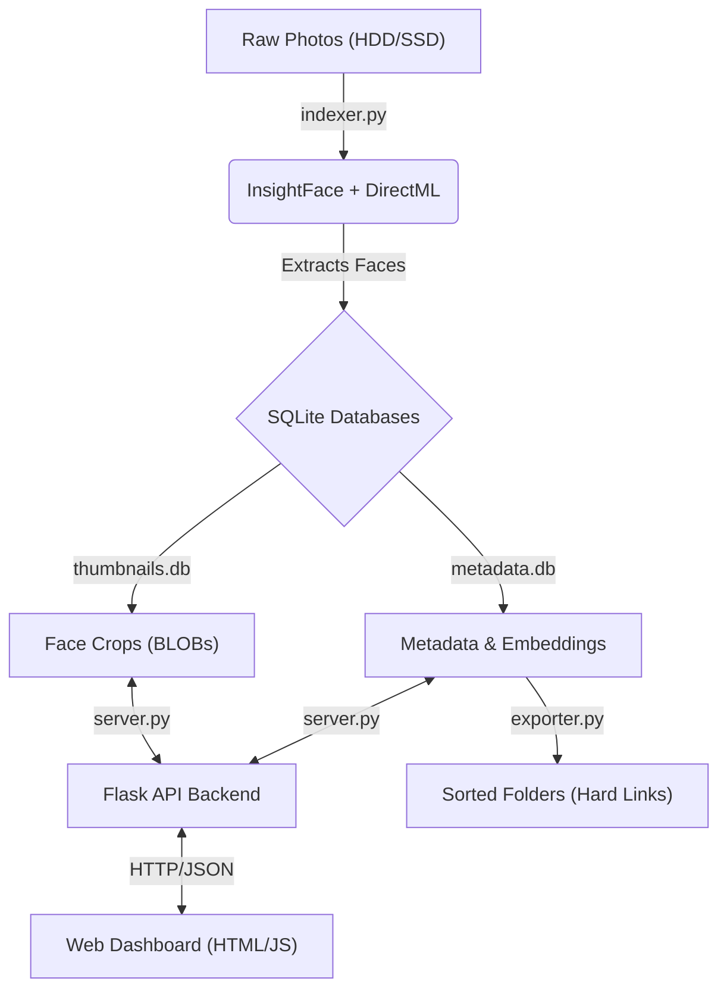

# Local AI Face Sorter - Project Documentation

**Date:** January 9, 2026  
**Status:** Operational V1.0  
**Authors:** Antigravity (AI) & User (Human-in-the-Loop)

---

## 1. Executive Summary

This project is a high-performance, privacy-first, local software solutions for organizing massive photo collections (100,000+ images) based on facial recognition. Unlike cloud services (Google Photos/iCloud), this runs entirely on your local machine using your GPU, ensuring zero privacy risk and zero recurring costs.

The system is designed to handle "scattered" datasets, allowing you to index photos from multiple drives and folders over time, while the AI "learns" the faces of your friends and family to automatically sort new incoming photos.

---

## 2. Architecture Overview

The system is decoupled into four distinct components to ensure scalability and robustness.



### Key Design Decisions:
1.  **DirectML Acceleration**: Uses `onnxruntime-directml` to leverage AMD/NVIDIA/Intel GPUs on Windows without needing complex CUDA installations.
2.  **Split Database**: 
    *   `metadata.db`: Lightweight, fast for querying and clustering.
    *   `thumbnails.db`: Heavy, stores binary image data. Kept separate to prevent massive filebloat from slowing down queries.
3.  **Hard Linking**: The exporter uses filesystem hard links (`os.link`) instead of copying files. This allows a photo containing 5 people to exist in 5 different folders while consuming **0 extra bytes** of disk space.
4.  **Online Learning**: The system calculates a "Centroid" (Average Face Vector) for every named person. As you confirm more photos, the mathematical model of that person becomes more accurate.

---

## 3. Component Deep Dive

### A. The Indexer (`indexer.py`)
This is the workhorse. It scans directories and extracts facial features.
*   **Engine**: InsightFace (Buffalo_L model).
*   **Process**:
    1.  Recursively finds images (`.jpg`, `.png`, etc.).
    2.  Hashes files to prevent duplicates.
    3.  Passes image to GPU for detection.
    4.  Extracts a 512-dimensional vector (embedding) for *every* face found.
    5.  Crops the face (generates thumbnail) and saves it to `thumbnails.db`.
    6.  Saves vector and path to `metadata.db`.
*   **Performance**: Process is I/O and GPU bound. Can process ~10-50 images per second depending on hardware.

### B. The Server (`server.py`)
The brain of the operation. Replaces the older Streamlit dashboard.
*   **Framework**: Flask (Python).
*   **Clustering Engine**: `DBSCAN` + `PCA`.
    *   **PCA**: Reduces 512 dimensions to 128 to speed up clustering by 10x.
    *   **DBSCAN**: Density-based clustering. It doesn't need to know "how many" people exist; it finds them based on density.
*   **Smart Features**:
    *   **Auto-Suggestion**: Compares new unknown clusters against "Known People" centroids using Cosine Similarity. If `< 0.45` distance, it suggests the name.
    *   **Centroid Updates**: When you rename a cluster, it recalculates the weighted average of that person's face vector.
*   **API Endpoints**:
    *   `POST /api/cluster`: triggers DBSCAN.
    *   `GET /api/clusters`: returns paginated groups of people.
    *   `POST /api/rename`: merges clusters and updates centroids.
    *   `POST /api/face/<id>/remove`: marks a face as noise (-1).

### C. The Frontend (`templates/index.html` + `static/`)
A custom Single Page Application (SPA).
*   **Tech**: Vanilla HTML5, CSS3, JavaScript (ES6). No react/vue bloat.
*   **Features**:
    *   **Dark Mode UI**: Clean, card-based interface.
    *   **Virtual Scroll / Pagination**: Handles 1000+ clusters efficiently.
    *   **Modal Viewer**: Full-screen, high-res image viewer with keyboard navigation (Right/Left arrows).
    *   **URL Sync**: Deep linking support (e.g. `?page=5&per_page=50`).
    *   **Interactive Removal**: Hover over a face to see "X" button to remove it from the cluster.

### D. The Exporter (`exporter.py`)
The physical manifest.
*   **Input**: Named people from DB.
*   **Output**: Folder structure `Output/PersonName/Image.jpg`.
*   **Safety**:
    *   **Link Mode (Default)**: Creates hard links. Safe to delete "sorted" files without losing originals.
    *   **Copy Mode**: Standard copy (safe but doubles space).
    *   **Move Mode**: Destructive move.
*   **Multi-Face Handling**: If an image contains Mom and Dad, the file is linked into *both* `.../Mom/` and `.../Dad/`.

### E. Advanced Machine Learning (`ml_core.py` & FairFace)
The system includes a custom-trained Neural Network for real-time race/demographic classification.
*   **Training Pipeline (`extract_fairface.py`, `train_race.py`)**: The model was trained from scratch using the FairFace dataset. It takes the 512D embeddings from InsightFace as input, maps them to 7 distinct demographic classes, and is saved as a lightweight `race_classifier.keras` model (~2MB).
*   **Robust Inference**: `server.py` queries `ml_core.py` using a **Majority Vote** system. By predicting the demographic for *every single face* in a cluster and taking the most common result, the UI effectively cancels out blurry/bad photos and displays highly accurate predictions natively in the cluster headers.
*   **Contextual Analysis**: Users can right-click any individual face in the Web UI to get an isolated AI prediction of just that specific photo.

---

## 4. Workflows

### Setup
1.  **Install Requirements**:
    ```powershell
    pip install -r requirements.txt
    ```
2.  **Verify GPU**:
    ```powershell
    python check_gpu_env.py
    ```

### Workflow 1: The Initial Sort (The "Big Bang")
1.  **Index Everything**:
    ```powershell
    python indexer.py "D:\Photos\2010"
    python indexer.py "D:\Photos\2011"
    # ... etc
    ```
    *Note: You can stop/start this. It skips existing files.*

2.  **Cluster & Label**:
    *   Run `python server.py`.
    *   Open `http://localhost:5000`.
    *   Adjust **EPS** slider (try 0.45). Click **Re-Cluster**.
    *   Go through the pages. Type "Mom", "Dad", "John" into the name fields.
    *   *Tip*: You don't need to name everyone. Just the ones you care about.

3.  **Export**:
    ```powershell
    python exporter.py "C:\Sorted_output" --mode link
    ```

### Workflow 2: The Incremental Add (New Photos)
1.  **Index New Folder**:
    ```powershell
    python indexer.py "E:\New_SD_Card"
    ```
2.  **Smart Sort**:
    *   Run `python server.py`.
    *   Click **Re-Cluster**.
    *   The system will compare the new faces against your saved "Mom" and "Dad".
    *   It will likely group them and suggest the names automatically ("Mom?").
    *   Review and confirm (rename "Mom?" -> "Mom").
    *   *This action makes the AI smarter by updating the centroid.*
3.  **Export Again**:
    *   Run `exporter.py` again. It only links the new files (checks if dest exists).

### Workflow 3: Resetting State (`reset_clusters.py`)
If you want to wipe your slate clean and start clustering from scratch without the painful wait of re-extracting faces:
1.  Run `python reset_clusters.py`.
2.  The script will safely delete all names and labels from the `people` database table and reset all faces back to `Unsorted` (-1) in the `faces` table.
3.  Your `thumbnails.db` and massive mathematical embeddings are kept perfectly intact.
4.  Click **Re-Cluster** in the web interface to instantly generate new groupings!

---


---

## 5. Technical Specifications: Database Deep Dive

The system uses a **Split-Database Architecture** to optimize for distinct IO patterns:
1.  **Metadata DB (`metadata.db`)**: High read/write frequency, small payload. Stores relationships and vectors.
2.  **Thumbnails DB (`thumbnails.db`)**: Low write frequency, massive payload. Stores images.

### A. Metadata Database (`metadata.db`)
This is the brain of the system.

#### 1. Table: `images`
Tracks every file scanned by the system.
| Column | Type | Purpose |
| :--- | :--- | :--- |
| `id` | `INTEGER PK` | Unique ID for the image file. |
| `path` | `TEXT UNIQUE` | Absolute path on disk (e.g., `D:\Photos\Img1.jpg`). |
| `processed` | `INTEGER` | Status flag (`0`=Pending, `1`=Done, `-1`=Error). Used to resume interrupted indexing. |

#### 2. Table: `faces`
Stores the raw biometric data for every detected face.
| Column | Type | Details |
| :--- | :--- | :--- |
| `id` | `INTEGER PK` | Unique ID for this specific face detection. |
| `image_id` | `INTEGER FK` | Links back to the `images` table. |
| `embedding` | `BLOB` | **The Fingerprint**. A 2,048-byte binary chunk representing a 512-float array. This is what the AI compares. |
| `cluster_id`| `INTEGER` | The "Person ID". `-1` means Noise/Unsorted. Positive integers map to `people.cluster_id`. |
| `det_score` | `FLOAT` | Confidence score (0.0 to 1.0). Higher means clearer face. |
| `bbox` | `TEXT` | JSON `[x, y, width, height]` coordinates of the face in the image. |
| `is_verified`| `BOOLEAN` | `True` if this face has been confirmed by a human (merged into a named person). |

#### 3. Table: `people`
The "Roster" of known identities.
| Column | Type | Details |
| :--- | :--- | :--- |
| `cluster_id`| `INTEGER PK` | The ID shared with `faces`. |
| `name` | `TEXT` | The human-readable label ("Mom", "Dad"). |
| `mean_embedding` | `BLOB` | **The Gold Standard**. The mathematical average of all confirmed faces for this person. Used for Smart Matching. |
| `face_count`| `INTEGER` | Number of faces used to calculate the `mean_embedding`. Used for weighted updates. |

### B. Thumbnails Database (`thumbnails.db`)
This is the heavy storage. Kept separate so `SELECT * FROM faces` doesn't load gigabytes of images.

#### 1. Table: `face_thumbnails`
| Column | Type | Details |
| :--- | :--- | :--- |
| `id` | `INTEGER PK` | Internal ID. |
| `face_id` | `INTEGER` | Links to `metadata.db`'s `faces.id`. |
| `thumbnail` | `BLOB` | A standard JPEG image file (bytes). Generated during indexing. Size ~5-15KB. |

### C. Performance Optimizations implemented
*   **WAL Mode (Write-Ahead-Logging)**: Both databases use `PRAGMA journal_mode=WAL`. This allows readers (the Web App) and writers (the Indexer) to work simultaneously without locking the entire file.
*   **Split Architecture**: By keeping thumbnails in a separate file, the OS page cache can keep the entire `metadata.db` in RAM for instant searching, while only loading thumbnails from disk when specifically requested by the UI.
*   **Binary Embeddings**: Storing embeddings as raw C-struct bytes (via `numpy.tobytes()`) is faster and 60% smaller than storing them as text/JSON strings.

---
*   **DBSCAN** is used because it allows "noise" (points that don't belong to any cluster). This is crucial because many faces in backgrounds are unrecognizable strangers.
*   **Cosine Metric**: We use Cosine Distance instead of Euclidean because face embeddings are angular representations.
*   **PCA**: We reduce dimensionality because DBSCAN struggles with "Curse of Dimensionality" in 512-D space. 128-D is the sweet spot for speed/accuracy.

### Hard Links Explained
A file on NTFS/Ext4 is just an inode pointing to data sectors.
*   **Original**: `C:\Photos\IMG_001.jpg` -> Inode 123
*   **Hard Link**: `C:\Sorted\Mom\IMG_001.jpg` -> Inode 123
*   Both entries point to the **same physical data**.
*   Deleting one entry effectively just "unlinks" it. the data remains until the link count drops to 0.

---

## 6. Future Improvements (Roadmap)
1.  **Video Support**: Extract frames from videos and sort them too.
2.  **Date Sorting**: Inside `Mom` folder, create subfolders `2023`, `2024` based on EXIF data.
3.  **Reverse Image Search**: Upload a photo of a stranger to see if they exist in your DB.
4.  **Face Quality Filter**: Expose the `det_score` threshold in the UI to hide blurry faces.

---


## 7. Version 2.1: The "Unsorted & Context" Update (Stable State)

**Date:** January 10, 2026
**Architect:** Antigravity
**Status:** Stable V2 Implementation

### Recent Critical Features
1.  **Context Menu (Right-Click)**:
    *   **Feature**: Right-clicking any face thumbnail opens a custom context menu.
    *   **"Move To..."**: Lists all Verified people. Clicking one moves the face instantly.
    *   **"Create New"**: The menu includes a text input at the top. Typing a name and hitting Enter creates a *new* cluster/person on the fly and moves the face there.
    *   **Smart Positioning**: The menu detects screen edges and re-positions itself to avoid being clipped.

2.  **Unsorted Visibility**:
    *   **Process**: Faces that DBSCAN identifies as "Noise" (Cluster -1) are now explicitly returned by the API as a cluster named **"⚠️ Unsorted"**.
    *   **Visibility**: This ensures these photos are not lost in the ether; they appear in the Workbench search or list so users can manually classify them.

3.  **Layout Fixes**:
    *   **CSS Flex Integration**: Fixed a critical bug where the main content area collapsed to 0 width. The `.split-container` now correctly uses `flex: 1` to fill the viewport next to the fixed-width sidebar.
    *   **Input Visibility**: Darkened input backgrounds for better contrast.

### Known Issues (Hand-off Notes)
*   **Frontend Caching**: The user has experienced "fucked" layouts that were resolved by file overwrites, but browser caching may still serve old JS/CSS. Hard Refresh is required.
*   **Unsorted "Inbox"**: Ideally, "Unsorted" should be a separate UI section (Separate API). This was attempted but reverted due to complexity/stability risks. Currently, it exists as a standard cluster in the list.

---

## 8. Version 2.0: The "Split-View" Overhaul (Legacy Log)

**Date:** January 10, 2026
**Architect:** Antigravity
**Scope:** Complete refactor of Frontend/Backend interaction model.

This section documents **every single change, design decision, and bug prevention mechanism** implemented during the transition from V1 (Single List) to V2 (Dual Workbench).

---

### A. The "Sorting Crisis" & Architectural Pivot
**Problem**: In V1, merging a cluster (e.g., "Unknown" -> "Mom") caused the UI to refresh, but the new "Mom" cluster would appear randomly in the list or "disappear" if the user was on the wrong page.
**Solution**: We fundamentally decoupled the data presentation into two state-independent columns.
1.  **Verified Library (Left)**: The "Safe Zone".
    *   **Logic**: Contains only clusters where `is_verified=True` or has a valid `Name`.
    *   **Sorting**: Hard-coded to `Count (Descending)`.
    *   **Critical Fix**: We added `named_list.sort(key=lambda x: x['count'], reverse=True)` in `server.py` line 226. This ensures that immediately after a merge, the new super-cluster rockets to the top of the list, giving the user immediate visual confirmation of the merge.
2.  **Workbench (Right)**: The "Action Zone".
    *   **Logic**: Contains all `is_verified=False` clusters.
    *   **Sorting**: `Count (Descending)`.
    *   **Purpose**: This list shrinks as you work.

---

### B. Backend API Refactoring (`server.py`)
The `/api/clusters` endpoint was previously a simple getter. It has been transformed into a sophisticated query engine accepting **6 parallel parameters**:

| Parameter | Type | Default | Purpose |
| :--- | :--- | :--- | :--- |
| `page_named` | `int` | `1` | Independent cursor for the Left column. |
| `page_unnamed` | `int` | `1` | Independent cursor for the Right column. |
| `per_page` | `int` | `20` | Limits items per page (Global setting). |
| `preview_size` | `int` | `24` | **New in V2**: Controls array slicing `faces[:preview_size]`. Allows dynamic density. |
| `search_named` | `str` | `""` | Filter for Left column (Case-insensitive). |
| `search_unnamed` | `str` | `""` | Filter for Right column. |

**Key Logic Blocks:**
*   **Search Filtering**: Implemented *before* pagination logic.
    ```python
    if search_named: named_list = [c for c in named_list if search_named in c['name'].lower()]
    ```
*   **Pagination Slicing**: We calculate start/end indices separately for both lists (`start_n`, `end_n` vs `start_u`, `end_u`) to allow the user to be on Page 5 of the Workbench and Page 1 of the Library simultaneously.
*   **Response Payload**: The JSON structure was expanded:
    ```json
    {
      "named_clusters": [...],
      "unnamed_clusters": [...],
      "pagination": {
        "named": { "page": 1, "total": 5, "count": 32 },   // "count" added for UI Headers
        "unnamed": { "page": 2, "total": 10, "count": 19 },
        "per_page": 20
      }
    }
    ```

---

### C. Frontend State Management (`app.js`)
This file saw the most aggressive changes. We moved from a "Passive" UI (displays what URL says) to an "Active" UI (URL reflects Input state).

#### 1. The "Input Fighting" Bug
**The Issue**: When the user tried to change `Clusters/Page` from "20" to "50", typing "5" would trigger an API call. The API would return "20" (because "5" wasn't saved yet), and the Javascript would overwrite the input back to "20" mid-typing.
**The Fix**: "Input Priority" Logic.
*   In `loadClusters`, we check `document.getElementById('per-page').value`.
*   **If it exists**: We use THAT as the source of truth for the API call.
*   **If it's empty**: We fallback to URL params.
*   **Result**: The input never snaps back; the user retains full control.

#### 2. Debounced Search
We implemented a filtering system that doesn't choke the server.
*   **Function**: `handleSearch()`
*   **Logic**: Uses `setTimeout(..., 300)`. It waits for you to stop typing for 300ms before firing `loadClusters()`.
*   **Auto-Reset**: Searching automatically resets `currentPageNamed` and `currentPageUnnamed` to `1` to prevent showing empty Results on Page 5.

#### 3. URL State Synchronization
We use `window.history.pushState` to build a "Deep Link" for every action.
*   **Updated Function**: `updateURL(pageNamed, pageUnnamed, searchNamed, searchUnnamed)`
*   This reads the Sidebar inputs dynamically to ensure `preview_size` and `per_page` are included in the Shareable URL.

---

### D. UI/UX & CSS Refinements (`style.css` / `index.html`)
We fought several layout wars to get the `Split View` perfect.

#### 1. The Z-Index Conflict
**Problem**: The new Search Inputs in the headers were unclickable. Mouse clicks were passing through them to the container below.
**Fix**:
*   Added `.search-input` class.
*   Enforced `z-index: 20` on all inputs.
*   Enforced `z-index: 100` on the Sidebar to always stay on top.

#### 2. The Horizontal Scroll Saga
**Problem**: Increasing the gap between columns to `40px` caused the content to exceed `100vw`, creating an ugly horizontal scrollbar.
**Fix**:
*   Reverted `gap` to `20px` in `.split-container`.
*   Relies on standard padding to separate the search bars.

#### 3. Pagination Controls
**Decision**: Moved pagination buttons (`< 1 / 5 >`) from bottom to **TOP**.
**Why**: In "Workbench" workflows, you often classify the top 3 items and want to move on. Scrolling to the bottom to hit "Next" destroys flow. Pagination at the top allows for high-velocity sorting.

#### 4. Cluster Counts
**Feature**: Added `(15)` next to "Verified Library" header.
**Implementation**: We extract `data.pagination.named.count` from the JSON response and inject it into `<span id="count-named">`. This provides instant feedback on how many Todo items remain.

### E. List of All Modified Files
1.  `server.py`: API logic, sorting, filtering, parameter handling.
2.  `index.html`: Grid layout, new inputs, header spans, pagination placement.
3.  `static/app.js`: Complete rewrite of state logic, fetchers, and rendering.
4.  `static/style.css`: Z-index fixes, input styling.
5.  `PROJECT_DOCUMENTATION.md`: (You are reading it).

**End of Documentation**
